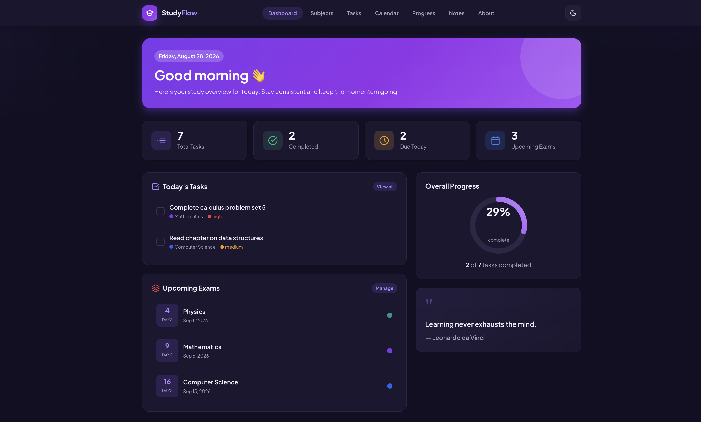
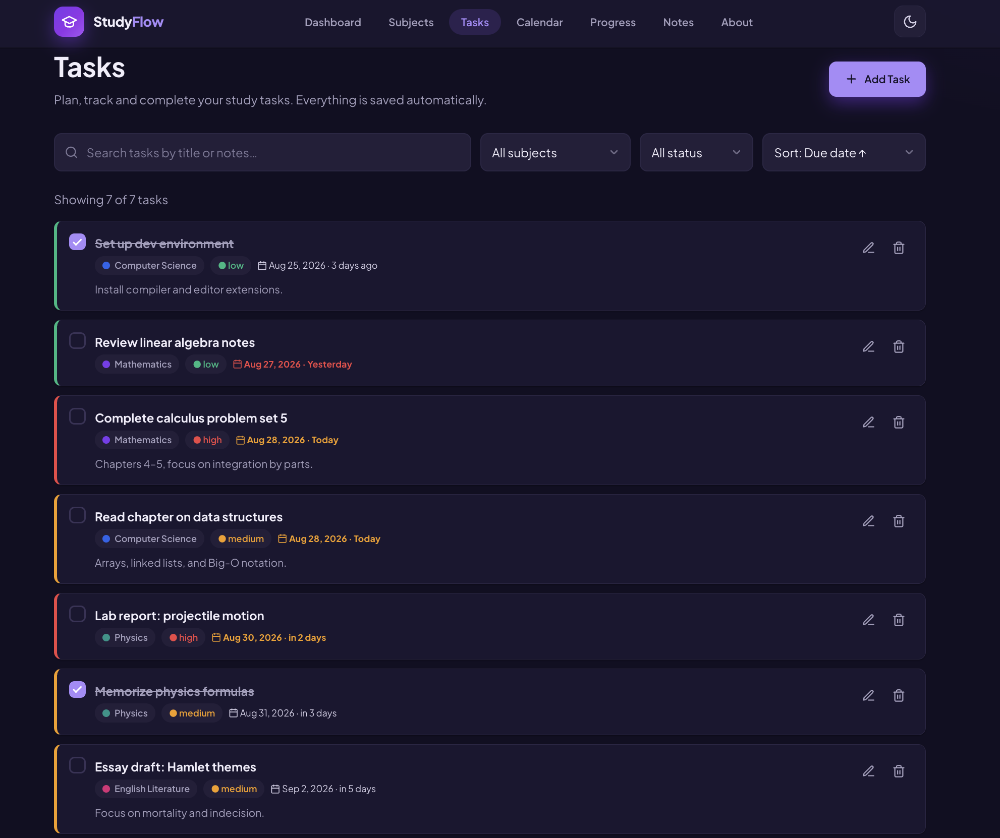
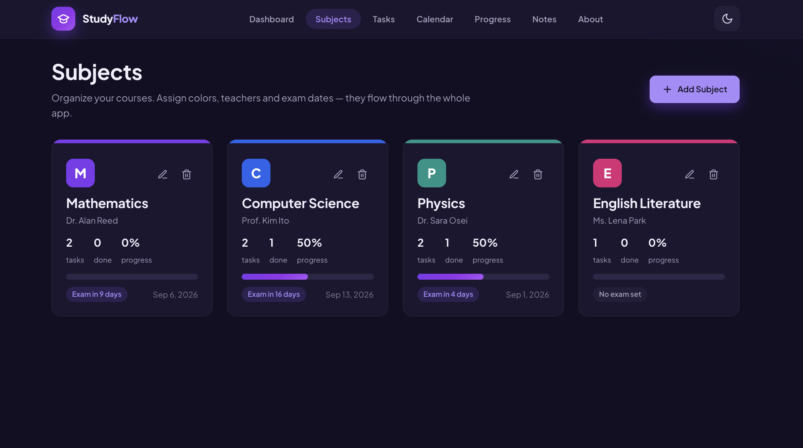
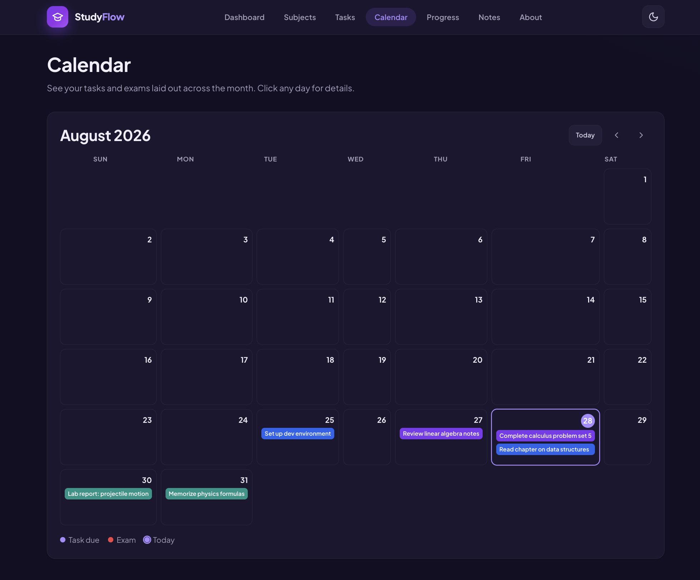
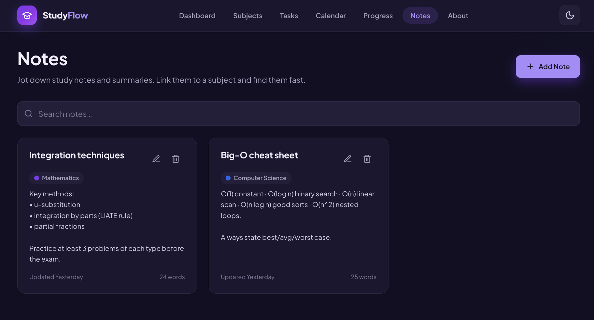
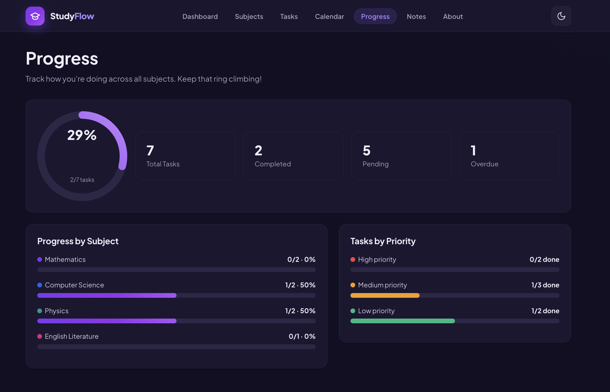
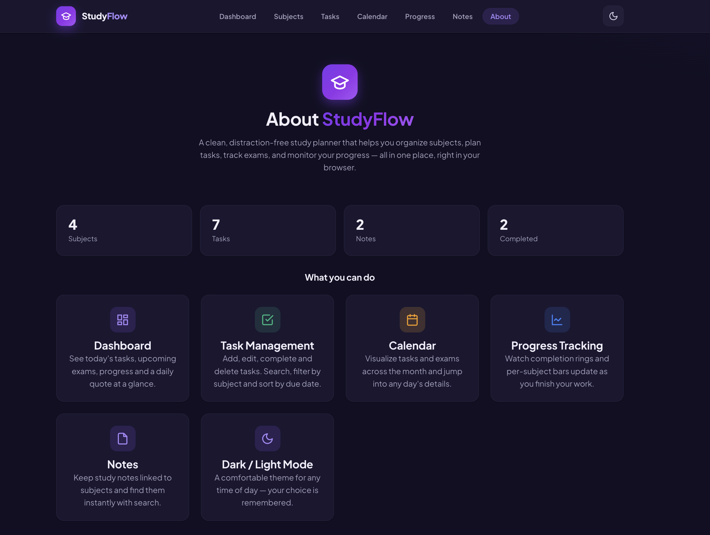

# 📚 StudyFlow

<p align="center">

A modern, responsive, distraction-free study planner built with **HTML, CSS and JavaScript**.

Organize subjects, manage tasks, track progress, write notes, and stay productive—all in one place.

</p>

<p align="center">

<a href="https://mohammedomarworks.github.io/StudyFlow/">

</a>

<a href="LICENSE">

</a>


</p>

---
## ✨ Features

- 📋 Create, edit and delete study tasks
- 📚 Organize subjects with color coding
- 📅 Interactive academic calendar
- 📝 Dedicated notes management
- 📈 Visual study progress tracking
- 🌙 Dark mode interface
- 💾 Automatic Local Storage persistence
- 🔍 Search and filter functionality
- 📱 Fully responsive design
- ⚡ Fast and lightweight (No frameworks)

---

## 🛠️ Tech Stack

| Technology | Purpose |
|------------|----------|
| HTML5 | Page Structure |
| CSS3 | Styling & Responsive Layout |
| JavaScript (ES6) | Application Logic |
| Local Storage API | Data Persistence |
| REST API | Quotes / External Data |
| Git | Version Control |
| GitHub Pages | Deployment |

---

## 📁 Project Structure

```text
StudyFlow/
│
├── assets/
│   └── screenshots/
│
├── css/
│   ├── base.css
│   ├── components.css
│   ├── pages.css
│   ├── responsive.css
│   └── variables.css
│
├── js/
│   ├── app.js
│   ├── dashboard.js
│   ├── tasks.js
│   ├── subjects.js
│   ├── calendar.js
│   ├── notes.js
│   ├── progress.js
│   ├── about.js
│   └── storage.js
│
├── pages/
│   ├── tasks.html
│   ├── subjects.html
│   ├── calendar.html
│   ├── notes.html
│   ├── progress.html
│   └── about.html
│
├── index.html
├── README.md
└── LICENSE
```

---

## 🚀 Getting Started

Clone the repository:

```bash
git clone https://github.com/mohammedomarworks/StudyFlow.git
```

Open the project folder and launch `index.html` with Live Server or any modern browser.

---

## 📸 Screenshots

### 🏠 Dashboard

The StudyFlow dashboard provides an overview of tasks, completed work, upcoming exams, and overall study progress.

<p align="center">
  
</p>

---

### 📋 Tasks

Manage academic tasks by adding, editing, completing, and deleting tasks.

<p align="center">
  
</p>

---

### 📚 Subjects

Organize different academic subjects and keep track of subject-related information.

<p align="center">
  
</p>

---

### 📅 Calendar

View important academic dates, tasks, and upcoming examinations through the study calendar.

<p align="center">
  
</p>

---

### 📝 Notes

Create and manage study notes in one centralized place.

<p align="center">
  
</p>

---

### 📊 Progress

Monitor academic progress and task completion through visual statistics.

<p align="center">
  
</p>

---

### ℹ️ About

Learn more about StudyFlow and its purpose as a student productivity application.

<p align="center">
  
</p>

## 🌐 Live Demo

🚀 **[Visit StudyFlow](https://mohammedomarworks.github.io/StudyFlow/)**


---

## 🚀 Roadmap

### Version 1.0.0 ✅
- [x] Responsive dashboard
- [x] Task management
- [x] Subject management
- [x] Calendar
- [x] Notes
- [x] Progress tracking
- [x] Dark mode
- [x] Local Storage support
- [x] GitHub Pages deployment

### Version 1.1.0
- [ ] UI/UX improvements
- [ ] Better animations
- [ ] Improved mobile experience

### Version 1.2.0
- [ ] Drag & Drop task management
- [ ] Advanced search & filters
- [ ] Keyboard shortcuts

### Version 1.5.0
- [ ] Pomodoro Timer
- [ ] Habit Tracker
- [ ] Study session analytics

### Version 2.0.0
- [ ] User authentication
- [ ] Cloud synchronization
- [ ] Database integration
- [ ] Real-time notifications

---

## 🤝 Contributing

Contributions, suggestions, and feedback are welcome. Feel free to fork the repository and submit a pull request.

---

## 📄 License

This project is licensed under the MIT License.

---

## 👨‍💻 Author

**Mohammed Omar**

GitHub: https://github.com/mohammedomarworks

---

⭐ If you like this project, consider giving it a star!