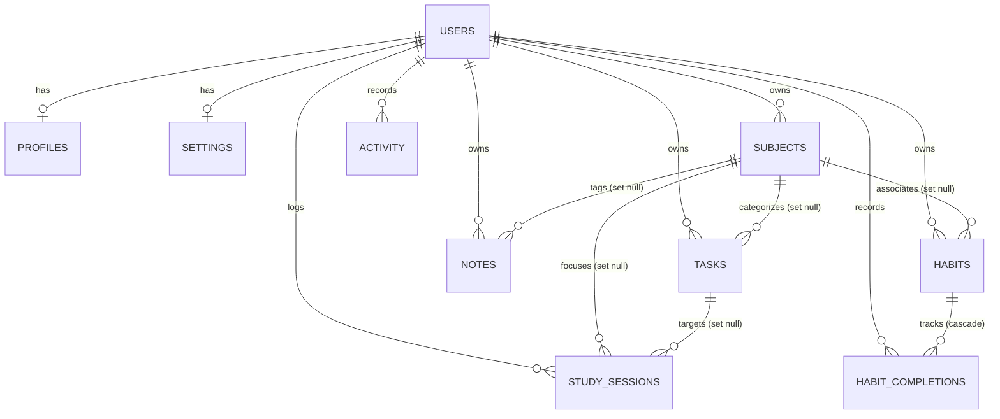

# StudyFlow v2.0 Architecture & Supabase Foundation

> **Current Status**: Phase E — Offline Resilience & Reliable Cloud Write Queue
> **Target Release**: StudyFlow v2.0
> **Stable Release**: StudyFlow v1.5.0
> **Active Git Branch**: `feature/v2-foundation`

---

## 1. Architectural Overview

StudyFlow v1.5.0 is an entirely offline, local-first academic planner running on vanilla HTML5, CSS3, and JavaScript, with all application state persisting in browser `localStorage`.

StudyFlow v2.0 introduces optional cloud synchronization, multi-device access, and authentication powered by **Supabase** (PostgreSQL, Auth, and Realtime), while strictly retaining the local-first, zero-dependency vanilla architecture.

### Target Multi-Tier Architecture

```text
┌─────────────────────────────────────────────────────────┐
│                    UI Layer                             │
│  (index.html, pages/*.html, css/*, vanilla DOM modules) │
└───────────────────────────┬─────────────────────────────┘
                            │
                            ▼
┌─────────────────────────────────────────────────────────┐
│                   Store API                             │
│        (js/storage.js — Stable v1.5.0 interface)        │
│    • In Local mode: reads/writes raw sp_* keys          │
│    • In Cloud mode: reads/writes isolated sp_cloud_*    │
│      cache and syncs asynchronously to CloudRepository  │
└───────────────────────────┬─────────────────────────────┘
                            │
                            ▼
┌─────────────────────────────────────────────────────────┐
│              Repository Boundary                        │
│                (js/repository.js)                       │
│  ┌────────────────────────┴──────────────────────────┐  │
│  ▼                                                   ▼  │
│ ┌────────────────────────┐   ┌────────────────────────┐ │
│ │   LocalRepository      │   │    CloudRepository     │ │
│ │ (wraps localStorage)   │   │  (Supabase PostgreSQL) │ │
│ └────────────────────────┘   └──────────────┬─────────┘ │
└─────────────────────────────────────────────┼───────────┘
                                              │
                                              ▼
                               ┌────────────────────────┐
                               │     Supabase Cloud     │
                               │  ├── Auth (Phase B)    │
                               │  ├── PostgreSQL (RLS)  │
                               │  └── Realtime (Phase D)│
                               └────────────────────────┘
```

### Phase Scope & Guarantees

- **Phase A (Foundation)**: Supabase PostgreSQL schema, Row Level Security, foreign key ownership constraints, safe client config.
- **Phase B (Authentication)**: Supabase Auth integration, sign up, sign in, password recovery, accessible navbar auth chip, and settings account card.
- **Phase C (Migration & Cloud CRUD)**:
  - **CloudRepository**: Full async CRUD implementation for Subjects, Tasks, Notes, Habits, Habit Completions, Study Sessions, and Settings.
  - **Migration Service (`js/migration.js`)**: Explicit user-controlled migration with preview modal, progress updates, foreign key mapping (String IDs -> UUIDs), and idempotent retry.
  - **Zero Data Loss Guarantee (`LOGOUT != DELETE LOCAL DATA`)**: Local planner `localStorage` keys (`sp_*`) are NEVER deleted, cleared, or overwritten during migration, in cloud mode, or on logout.
  - **Cache Isolation**: Cloud data caches in `sp_cloud_${key}_${userId}`, leaving local `sp_*` 100% intact.
  - **Unauthenticated & Unmigrated Users**: 100% v1.5.0 local behavior with zero disruption.

**Critical Non-Goals in Phase C**:
- **No Realtime subscriptions**: Live multi-tab / multi-device websockets are deferred to Phase D.
- **No push notifications**.
- **No automatic migration without user consent**.
- **No framework migration**: Pure vanilla HTML/CSS/JavaScript.

---

## 2. Database Schema Design

The database schema is defined in [`supabase/migrations/0001_initial_schema.sql`](file:///Users/omar/study-planner/supabase/migrations/0001_initial_schema.sql). It mirrors the v1.5.0 client data model while adhering to PostgreSQL best practices.

### Entity-Relationship Diagram



### Table Specifications

#### 1. `public.profiles`
Stores student profile metadata linked 1:1 with `auth.users`.
- `id` (`uuid`, PK, references `auth.users(id)` on delete cascade)
- `display_name` (`text`)
- `avatar_url` (`text`, nullable)
- `created_at` (`timestamptz`, default `now()`)
- `updated_at` (`timestamptz`, default `now()`)

#### 2. `public.subjects`
Academic courses and syllabi.
- `id` (`uuid`, PK, default `gen_random_uuid()`)
- `user_id` (`uuid`, NOT NULL, references `auth.users(id)` on delete cascade)
- `name` (`text`, NOT NULL)
- `code` (`text`, nullable)
- `teacher` (`text`, nullable)
- `color` (`text`, NOT NULL, default `'#7c3aed'`)
- `exam_date` (`date`, nullable)
- `created_at` (`timestamptz`, default `now()`)
- `updated_at` (`timestamptz`, default `now()`)
- *Index*: `subjects(user_id)`

#### 3. `public.tasks`
Academic assignments, revisions, and projects.
- `id` (`uuid`, PK, default `gen_random_uuid()`)
- `user_id` (`uuid`, NOT NULL, references `auth.users(id)` on delete cascade)
- `subject_id` (`uuid`, nullable, references `public.subjects(id)` **ON DELETE SET NULL**)
- `title` (`text`, NOT NULL)
- `notes` (`text`, nullable)
- `category` (`text`, NOT NULL, default `'General'`)
- `priority` (`text`, NOT NULL, default `'medium'`)
- `due_date` (`date`, nullable)
- `estimate_minutes` (`integer`, NOT NULL, default `0`)
- `completed` (`boolean`, NOT NULL, default `false`)
- `completed_at` (`timestamptz`, nullable)
- `created_at` (`timestamptz`, default `now()`)
- `updated_at` (`timestamptz`, default `now()`)
- *Indexes*: `tasks(user_id)`, `tasks(user_id, due_date)`, `tasks(user_id, completed)`, `tasks(subject_id)`

#### 4. `public.notes`
Markdown study notes and course cheat sheets.
- `id` (`uuid`, PK, default `gen_random_uuid()`)
- `user_id` (`uuid`, NOT NULL, references `auth.users(id)` on delete cascade)
- `subject_id` (`uuid`, nullable, references `public.subjects(id)` **ON DELETE SET NULL**)
- `title` (`text`, NOT NULL, default `'Untitled Note'`)
- `content` (`text`, NOT NULL, default `''`)
- `tags` (`text[]`, default `'{}'::text[]`)
- `pinned` (`boolean`, NOT NULL, default `false`)
- `created_at` (`timestamptz`, default `now()`)
- `updated_at` (`timestamptz`, default `now()`)
- *Indexes*: `notes(user_id)`, `notes(subject_id)`, `notes(user_id, updated_at)`

#### 5. `public.habits`
Habit definitions for daily or weekday study routines.
- `id` (`uuid`, PK, default `gen_random_uuid()`)
- `user_id` (`uuid`, NOT NULL, references `auth.users(id)` on delete cascade)
- `subject_id` (`uuid`, nullable, references `public.subjects(id)` **ON DELETE SET NULL**)
- `name` (`text`, NOT NULL)
- `description` (`text`, nullable)
- `icon` (`text`, NOT NULL, default `'⚡'`)
- `color` (`text`, NOT NULL, default `'#7c3aed'`)
- `frequency` (`text`, NOT NULL, default `'daily'`, check constraint `frequency IN ('daily', 'weekdays')`)
- `target_days` (`jsonb`, NOT NULL, default `'[0, 1, 2, 3, 4, 5, 6]'::jsonb`)
- `archived` (`boolean`, NOT NULL, default `false`)
- `created_at` (`timestamptz`, default `now()`)
- `updated_at` (`timestamptz`, default `now()`)
- *Indexes*: `habits(user_id)`, `habits(subject_id)`, `habits(user_id, archived)`

#### 6. `public.habit_completions`
Daily completion records for habits.
- `id` (`uuid`, PK, default `gen_random_uuid()`)
- `user_id` (`uuid`, NOT NULL, references `auth.users(id)` on delete cascade)
- `habit_id` (`uuid`, NOT NULL, references `public.habits(id)` **ON DELETE CASCADE**)
- `date` (`date`, NOT NULL)
- `completed_at` (`timestamptz`, default `now()`)
- *Constraint*: `UNIQUE(habit_id, date)` — ensures idempotency and prevents duplicates.
- *Indexes*: `habit_completions(user_id)`, `habit_completions(habit_id)`, `habit_completions(user_id, date)`

#### 7. `public.study_sessions`
Pomodoro focus sessions and rest intervals.
- `id` (`uuid`, PK, default `gen_random_uuid()`)
- `user_id` (`uuid`, NOT NULL, references `auth.users(id)` on delete cascade)
- `subject_id` (`uuid`, nullable, references `public.subjects(id)` **ON DELETE SET NULL**)
- `task_id` (`uuid`, nullable, references `public.tasks(id)` **ON DELETE SET NULL**)
- `type` (`text`, NOT NULL, default `'focus'`)
- `duration_minutes` (`integer`, NOT NULL, default `25`)
- `notes` (`text`, nullable)
- `completed_at` (`timestamptz`, default `now()`)
- `created_at` (`timestamptz`, default `now()`)
- *Indexes*: `study_sessions(user_id)`, `study_sessions(user_id, completed_at)`, `study_sessions(subject_id)`, `study_sessions(task_id)`

#### 8. `public.activity`
Recent chronological event logs.
- `id` (`uuid`, PK, default `gen_random_uuid()`)
- `user_id` (`uuid`, NOT NULL, references `auth.users(id)` on delete cascade)
- `type` (`text`, NOT NULL)
- `text` (`text`, NOT NULL)
- `meta` (`jsonb`, nullable)
- `timestamp` (`timestamptz`, default `now()`)
- *Indexes*: `activity(user_id)`, `activity(user_id, timestamp)`

#### 9. `public.settings`
Per-user preferences and Pomodoro configuration (exactly 1 row per user).
- `user_id` (`uuid`, PK, references `auth.users(id)` on delete cascade)
- `theme` (`text`, NOT NULL, default `'system'`)
- `pomodoro` (`jsonb`, NOT NULL, default `'{"focus": 25, "shortBreak": 5, "longBreak": 15, "sound": true, "autoBreak": false, "dailyGoal": 120}'::jsonb`)
- `preferences` (`jsonb`, NOT NULL, default `'{"confirmDelete": true, "defaultTaskSort": "due-asc", "motion": "system"}'::jsonb`)
- `last_export_at` (`timestamptz`, nullable)
- `created_at` (`timestamptz`, default `now()`)
- `updated_at` (`timestamptz`, default `now()`)

---

## 3. Security Architecture & RLS Model

### Row Level Security Principles
1. **RLS Enabled Globally**: `ALTER TABLE public.<table_name> ENABLE ROW LEVEL SECURITY;` is executed across all 9 tables.
2. **Explicit Authenticated Targeting**: All policies declare `TO authenticated`. Anonymous (`anon`) requests are rejected by default with zero read or write access.
3. **Strict Isolation**: Every policy enforces `(select auth.uid()) = user_id` (or `= id` for `profiles`).
4. **Granular Operations**: Separate policies are declared for `SELECT`, `INSERT`, `UPDATE`, and `DELETE`.

### Cross-User Reference Protection (Defense-in-Depth)

A common vulnerability in multi-tenant schemas is an authenticated user inserting their own record (`user_id = auth.uid()`), but pointing a foreign key (e.g. `subject_id`) to a resource owned by another user.

StudyFlow implements **two layers of protection**:

#### Layer 1: RLS `WITH CHECK` Subquery Validation
Every INSERT and UPDATE policy on child tables validates that the referenced entity belongs to `auth.uid()`:
```sql
CREATE POLICY "tasks_insert_authenticated" ON public.tasks
  FOR INSERT TO authenticated
  WITH CHECK (
    (select auth.uid()) = user_id
    AND (
      subject_id IS NULL OR EXISTS (
        SELECT 1 FROM public.subjects
        WHERE subjects.id = tasks.subject_id AND subjects.user_id = auth.uid()
      )
    )
  );
```

#### Layer 2: PostgreSQL Constraint Trigger (`check_entity_ownership`)
As defense-in-depth, a trigger function runs BEFORE INSERT OR UPDATE on `tasks`, `notes`, `habits`, `habit_completions`, and `study_sessions`. Even if a statement bypasses RLS in a server context, cross-user references are rejected with an exception:
```sql
CREATE OR REPLACE FUNCTION public.check_entity_ownership()
RETURNS trigger LANGUAGE plpgsql AS $$
BEGIN
  IF TG_TABLE_NAME IN ('tasks', 'notes', 'habits') THEN
    IF NEW.subject_id IS NOT NULL THEN
      IF NOT EXISTS (SELECT 1 FROM public.subjects WHERE id = NEW.subject_id AND user_id = NEW.user_id) THEN
        RAISE EXCEPTION 'Cross-user violation: Referenced subject does not belong to the user.';
      END IF;
    END IF;
  ...
  RETURN NEW;
END;
$$;
```

### Automatic User Provisioning Trigger

When a user signs up through Supabase Auth, PostgreSQL automatically creates their initial profile and settings records via a `SECURITY DEFINER` trigger:
```sql
CREATE OR REPLACE FUNCTION public.handle_new_user()
RETURNS trigger LANGUAGE plpgsql SECURITY DEFINER SET search_path = public AS $$
BEGIN
  INSERT INTO public.profiles (id, display_name, avatar_url)
  VALUES (
    NEW.id,
    COALESCE(NEW.raw_user_meta_data->>'display_name', NEW.raw_user_meta_data->>'full_name', split_part(NEW.email, '@', 1), 'Student'),
    NEW.raw_user_meta_data->>'avatar_url'
  );

  INSERT INTO public.settings (user_id)
  VALUES (NEW.id)
  ON CONFLICT (user_id) DO NOTHING;

  RETURN NEW;
END;
$$;

CREATE TRIGGER on_auth_user_created
  AFTER INSERT ON auth.users
  FOR EACH ROW EXECUTE FUNCTION public.handle_new_user();
```

---

## 4. Frontend Configuration & Client Design

### Static Site Compatibility
StudyFlow has zero bundlers and zero build steps. To maintain compatibility with GitHub Pages:
- Configuration is loaded via `js/supabase-config.js` or `js/supabase-config.local.js`:
  ```javascript
  window.STUDYFLOW_SUPABASE_CONFIG = {
    url: "https://your-project.supabase.co",
    publishableKey: "sb_pub_..."
  };
  ```
- `js/supabase-config.local.js`, `.env*`, and `*.local.js` are git-ignored.
- `js/supabase-config.example.js` serves as a template.

### Critical Security Rules
- **Browser code MUST use ONLY the Supabase Project URL and the Public / Publishable Key.**
- **NEVER use `service_role` keys, backend secret keys, or database passwords in frontend code.**
- `js/supabase.js` includes an active security validator that inspects keys and JWT tokens. If a key begins with `sb_sec_`, contains `service_role`, or contains a JWT claim with `role: 'service_role'`, initialization is aborted with a security error.

### Graceful Fallback
If configuration is omitted or the Supabase SDK is not loaded:
- `StudyFlowSupabase.getClient()` returns `null`.
- `StudyFlowSupabase.isConfigured()` returns `false`.
- Zero errors are thrown, ensuring the local v1.5.0 application runs smoothly offline.

---

## 5. Repository Abstraction & Migration Architecture

Located in [`js/repository.js`](file:///Users/omar/study-planner/js/repository.js) and [`js/migration.js`](file:///Users/omar/study-planner/js/migration.js):

- `BaseRepository`: Abstract interface defining CRUD operations for subjects, tasks, notes, habits, completions, sessions, activity, and settings.
- `LocalRepository`: Direct wrapper over the existing `Store` API (`js/storage.js`).
- `CloudRepository`: Supabase PostgREST client implementation providing asynchronous CRUD for all 7 entities, schema mappers (snake_case <-> camelCase), and cache hydration into `sp_cloud_*_${userId}`.
- `RepositoryFactory`: Singleton that dynamically exposes `getActive()`, manages mode transitions (`'local'` vs `'cloud'`), and notifies subscribed UI components.
- `StudyFlowMigration`: Migration engine supporting `getLocalSummary()`, `preview()`, `migrate()`, `getStatus()`, and `reset()`.

### Referential Integrity & ID Mapping

- Local IDs (e.g. `'s1'`, `'t1'`) are mapped to persistent PostgreSQL UUIDs via `generateUUID()`.
- ID mappings are cached per-user in `sp_migration_map_${userId}` to ensure idempotent retry and prevent duplicate records in cloud tables.
- Foreign keys (`tasks.subject_id`, `notes.subject_id`, `habits.subject_id`, `habit_completions.habit_id`, `study_sessions.subject_id`, `study_sessions.task_id`) are mapped before insertion in strict dependency order.

### Zero Data Loss Guarantees

- `localStorage` keys `sp_*` are NEVER cleared, deleted, or overwritten during migration, in cloud mode, or on logout.
- In Cloud Mode, temporary cache reads/writes are routed to isolated keys `sp_cloud_${entity}_${userId}`.
- Users can toggle between Cloud Mode and a read-only Local Backup View at any time from Settings.

---

## 6. Manual Setup Steps in Supabase

When connecting a new Supabase project:

1. **Create Supabase Project**:
   - Go to [database.new](https://database.new) or your Supabase Dashboard and create a new project.
2. **Apply Migration**:
   - Open the **SQL Editor** in your Supabase Dashboard.
   - Copy the contents of [`supabase/migrations/0001_initial_schema.sql`](file:///Users/omar/study-planner/supabase/migrations/0001_initial_schema.sql).
   - Click **Run**.
3. **Retrieve API Credentials**:
   - Go to **Project Settings → API**.
   - Copy **Project URL** and **anon / public** key.
4. **Configure Local Client**:
   - Create `js/supabase-config.local.js` (or edit `js/supabase-config.js`):
     ```javascript
     window.STUDYFLOW_SUPABASE_CONFIG = {
       url: "https://<your-ref>.supabase.co",
       publishableKey: "<your-anon-or-publishable-key>"
     };
     ```
5. **Run Connectivity Check**:
   - Open StudyFlow in the browser and run in Developer Tools Console:
     ```javascript
     await StudyFlowSupabaseTest.run();
     ```

---

## 7. Verification & Testing

### Automated Test Suites
1. **Node.js Schema & Client Suite**:
   ```bash
   node tests/database-schema.test.js
   ```
   Verifies migration structure, 9 tables, constraints, indexes, RLS policies, ownership triggers, and client validation.
2. **Habit Tracker Suite (v1.5.0 Regression)**:
   ```bash
   node tests/habits.test.js
   ```
   Verifies all 11 local storage habit test cases.
3. **Application Regression Suite**:
   ```bash
   node tests/app-regression.test.js
   ```
   Verifies all HTML pages and script references.
4. **Authentication Suite (Phase B)**:
   ```bash
   node tests/auth.test.js
   ```
   Verifies 12 authentication workflows, validation, and logout safety.
5. **Migration & Cloud CRUD Suite (Phase C)**:
   ```bash
   node tests/migration.test.js
   ```
   Verifies 10 migration, CloudRepository CRUD, idempotency, and isolation test cases.
6. **Realtime Synchronization Suite (Phase D)**:
   ```bash
   node tests/realtime.test.js
   ```
   Verifies 16 Realtime manager lifecycle, event mapping, cache mutation, LWW conflict resolution, active form protection, and cross-user isolation test cases.
7. **Offline Sync & Cloud Write Queue Suite (Phase E)**:
   ```bash
   node tests/sync-queue.test.js
   ```
   Verifies 18 offline queue lifecycle, durable storage, compaction, FIFO replay, retry backoff, LWW conflict resolution, error classification, and isolation test cases.
8. **JavaScript Syntax Check**:
   ```bash
   node -c js/*.js
   ```
   Validates syntax across all JavaScript files.

---

## 8. Realtime Synchronization & Conflict Handling (Phase D)

StudyFlow v2.0 Phase D implements multi-tab and multi-device live data synchronization for authenticated users in Cloud Mode.

### Realtime Architecture Diagram

```text
  Client A (Device 1)                       Client B (Device 2)
 ┌───────────────────────┐                 ┌───────────────────────┐
 │  User edits Task      │                 │  Active View (Tasks)  │
 └──────────┬────────────┘                 └───────────▲───────────┘
            │                                          │ (studyflow:realtime-change)
            ▼                                          │
 ┌───────────────────────┐                 ┌───────────┴───────────┐
 │ Store.saveTask()      │                 │ Realtime Manager      │
 └──────────┬────────────┘                 │ (js/realtime.js)      │
            │                                          ▲
            ▼                                          │ (postgres_changes WebSocket)
 ┌───────────────────────┐                 ┌───────────┴───────────┐
 │ Supabase PostgREST    │───────────────► │ Supabase Realtime WS  │
 │ (public.tasks UPDATE) │ (Replication)   │ (studyflow_realtime)  │
 └───────────────────────┘                 └───────────────────────┘
```

### Core Design Principles

1. **Single Reusable Channel**:
   - Authenticated Cloud Mode clients maintain exactly ONE channel: `studyflow_realtime_${userId}`.
   - Listens to `postgres_changes` across all 7 user-owned tables: `subjects`, `tasks`, `notes`, `habits`, `habit_completions`, `study_sessions`, `settings`.
   - Filtered at the database/subscription level by `user_id=eq.${userId}`.

2. **Cache Isolation & Zero Feedback Loops**:
   - Inbound remote events mutate the client's isolated cloud cache (`sp_cloud_${tableKey}_${userId}`) directly via `Realtime.applyRemoteEvent`.
   - Never calls `Store.save*()` or `CloudRepository.save*()`, completely eliminating circular write-back loops.
   - Local backup `sp_*` storage remains strictly isolated and untouched.

3. **Deterministic Last-Writer-Wins (LWW) Conflict Policy**:
   - Every table uses server timestamps (`updated_at`, `completed_at`, `created_at`).
   - `applyRemoteEvent` compares incoming entity timestamp against cached entity timestamp.
   - If `incomingTimestamp < existingTimestamp`, the incoming event is rejected (`reason: 'stale_event'`) to prevent stale overwrites.
   - If `incomingTimestamp >= existingTimestamp`, the incoming record updates the cache and emits a UI update event.

4. **Active Form Editing Protection**:
   - `Realtime.isUserActivelyEditing(table, recordId)` checks if an active modal (`#taskModal`, `#subjectModal`, `#noteModal`, `#habitModal`) is open with matching entity ID.
   - Prevents active user inputs in dirty forms from being silently overwritten in the background.
   - Triggers non-blocking warning toasts to notify the user of concurrent edits.

5. **Lifecycle & Status Observability**:
   - `Realtime.initialize()` binds to `Auth.onAuthStateChange` and `RepositoryFactory.onModeChange`.
   - Automatically subscribes upon entering Cloud Mode; cleanly destroys channel upon sign-out or switching to Local Mode.
   - Settings page displays live connection status badge (`● Realtime Sync Connected` / `○ Disconnected`) and formatted last synced time.

6. **Phase D Explicit Limitations & Non-Goals**:
   - **No Offline Write Queues**: Offline mutation queues are deferred to Phase E.
   - **No Push Notifications**: No Web Push or Service Worker notification handlers.
   - **No Multi-User Collaboration**: Synchronizes state between devices of the SAME authenticated user.

---

## 9. Offline Resilience & Reliable Cloud Write Queue (Phase E)

StudyFlow v2.0 Phase E ensures authenticated users in Cloud Mode experience zero data loss during temporary network disconnects or Supabase downtime. All mutations made while offline are immediately visible via optimistic cache updates, queued durably, and safely replayed when connectivity returns.

### Architecture & Write Flow

```text
       User Mutation (e.g., Save Task)
                      │
                      ▼
             Store.saveTask(task)
                      │
                      ▼
        CloudRepository.saveTask(task)
                      │
           Is Network Available?
            ├── YES ──► PostgREST Write ──► Success ──► Update Local Cloud Cache
            │                 │
            │               Error (Network/Transient)
            │                 │
            └── NO  ──────────┴─────────────────────────► Offline Queue Fallback
                                                                │
                                ┌───────────────────────────────┴───────────────────────────────┐
                                ▼                                                               ▼
                     Optimistic Cache Update                                         Durable Queue Enqueue
             `sp_cloud_tasks_${userId}` updated immediately                   `sp_sync_queue_${userId}` in localStorage
             UI re-renders immediately without blocking                       Entity marked pending with monotonic retry backoff
                                                                                                │
                                ┌───────────────────────────────────────────────────────────────┘
                                ▼
                       Connectivity Restored
                     (or Manual "Sync Now")
                                │
                                ▼
                    SyncQueue.process() Engine
                                │
               ┌────────────────┴────────────────┐
               ▼                                 ▼
       Queue Compaction                 Single-Worker Lock
   Coalesces multiple updates;      Ensures FIFO ordering; avoids
   cancels create + delete pairs    concurrent execution races
               │
               ▼
   LWW Timestamp Validation
   Checks remote `updated_at`; drops
   stale offline edits safely
               │
               ▼
   Execute Replay via Supabase PostgREST
        ├── Success: Remove item from queue; trigger `studyflow:sync-change`
        ├── Transient Failure (0, 5xx): Increment attempt; back off (1s..30s + jitter)
        ├── Auth Failure (401): Pause queue; wait for session refresh
        └── Permanent Failure (400, 403, 422, RLS): Quarantine/remove; warn user
```

### Core Design Principles

1. **Durable Persistence (`sp_sync_queue_${userId}`)**:
   - Mutations are captured durably in browser `localStorage` under a user-scoped key (`sp_sync_queue_${userId}`).
   - Schema per item:
     - `id`: Unique queue mutation identifier (`sqm_${Date.now()}_${random}`).
     - `table`: Target database table (`subjects`, `tasks`, `notes`, `habits`, `habit_completions`, `study_sessions`, `settings`).
     - `operation`: Mutation type (`UPSERT`, `DELETE`, `SET_HABIT_COMPLETION`).
     - `recordId`: Primary key of the affected entity.
     - `payload`: Data payload to write.
     - `queuedAt`: ISO-8601 timestamp of when the mutation was locally created.
     - `clientTimestamp`: Timestamp used for Last-Writer-Wins comparisons.
     - `attempts`: Number of replay attempts.
     - `nextRetryAt`: Epoch millisecond timestamp after which replay is permitted.
     - `lastError`: Error description if a prior replay failed.
     - `status`: `'pending'`, `'in_flight'`, or `'failed'`.

2. **Optimistic Local Cloud Cache Mutations**:
   - To provide an instantaneous, responsive UI, `CloudRepository` mutates the client's cloud cache (`sp_cloud_${tableKey}_${userId}`) synchronously upon enqueue (`_optimisticSave`, `_optimisticDelete`, `_optimisticSetHabitCompletion`, `_optimisticSaveSettings`).
   - The UI immediately displays changes without waiting for round-trip network acknowledgment.

3. **Single-Worker FIFO Concurrency Engine**:
   - `StudyFlowSyncQueue` maintains an in-memory execution lock (`_isProcessing` and `_currentProcessPromise`) with a drain loop (`_processAgain`).
   - Guarantees sequential, in-order execution of queued mutations per user.
   - Eliminates race conditions between simultaneous UI actions, background retry timers, and manual "Sync Now" button presses.

4. **Queue Compaction (Coalescing & Cancellation)**:
   - Before executing a batch replay, `compactQueue()` inspects the queue:
     - **Update-after-Update / Upsert-after-Upsert**: Successive updates to the same entity are merged, keeping only the latest payload and client timestamp.
     - **Create-then-Delete**: If an entity was created offline and subsequently deleted before syncing to the cloud, both mutations are pruned from the queue.
     - **Update-then-Delete**: An update followed by a deletion is collapsed into just the deletion.
   - Compaction reduces network calls and eliminates redundant server roundtrips.

5. **Deterministic Last-Writer-Wins (LWW) Conflict Resolution**:
   - Before executing an `UPSERT` on an entity that already exists remotely, the sync worker checks the remote entity's `updated_at` server timestamp.
   - If `remoteRecord.updated_at > queuedItem.clientTimestamp`, another client wrote newer data to the cloud while this client was offline.
   - The stale queued write is dropped (`resolution: 'dropped_stale'`), preserving the integrity of the remote master record without raising fatal errors.

6. **Classified Error Handling & Exponential Backoff**:
   - Errors encountered during replay are classified into three distinct categories:
     - **Transient Errors**: Network disconnects, timeout, HTTP 500/502/503/504, `TypeError: Failed to fetch`. The item remains in the queue. `attempts` is incremented, and exponential backoff with jitter is applied: `[1s, 2s, 5s, 10s, 30s]`.
     - **Authentication Errors**: HTTP 401, invalid/expired JWT token. The queue pauses without clearing items until user authentication is re-established.
     - **Permanent Errors**: HTTP 400, 403, 404, 409, 422, Row Level Security violations, or schema mismatches. To prevent queue head-of-line blocking, permanent errors are removed from the active queue, recorded to permanent error logs, and flagged to the user.

7. **Zero Feedback Loops with Realtime**:
   - Remote Realtime changes delivered via WebSocket mutate `sp_cloud_*` directly; they NEVER enter the write queue.
   - Queue replay directly calls PostgREST via Supabase client, emits local `studyflow:sync-change` events, and deletes the synced queue record without bouncing back through the Realtime inbound handler.
   - Local backup `sp_*` storage remains strictly isolated and untouched.

8. **User Experience & Observability**:
   - `window.addEventListener('online')` and `window.addEventListener('offline')` trigger instant queue status transitions and non-intrusive toast notices.
   - Settings page displays a dedicated **Offline Sync & Cloud Queue** card with:
     - Real-time queue status indicator (`● All Cloud Changes Synced` / `▲ N Changes Queued Offline` / `⟳ Syncing...`).
     - "Sync Now" manual trigger button with loading state.
     - Clean lifecycle teardown on logout (`SyncQueue.destroy()`).

9. **Explicit Limitations & Non-Goals in Phase E**:
   - **No Service Worker / Background Sync API**: Standard browser-level APIs only.
   - **No Push Notifications**: No Web Push API or Notification permission prompts.
   - **No Automatic Migration**: Local-to-cloud migration remains an explicit, user-initiated action.
