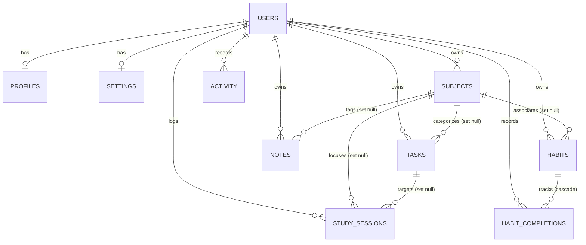

# StudyFlow v2.0 Architecture & Supabase Foundation

> **Current Status**: Phase A — Supabase Foundation  
> **Target Release**: StudyFlow v2.0  
> **Stable Release**: StudyFlow v1.5.0  
> **Active Git Branch**: `feature/v2-foundation`

---

## 1. Architectural Overview

StudyFlow v1.5.0 is an entirely offline, local-first academic planner running on vanilla HTML5, CSS3, and JavaScript, with all application state persisting in browser `localStorage`.

StudyFlow v2.0 introduces optional cloud synchronization, multi-device access, and authentication powered by **Supabase** (PostgreSQL, Auth, and Realtime), while strictly retaining the local-first, zero-dependency vanilla architecture.

### Target Multi-Tier Architecture

```text
┌─────────────────────────────────────────────────────────┐
│                    UI Layer                             │
│  (index.html, pages/*.html, css/*, vanilla DOM modules) │
└───────────────────────────┬─────────────────────────────┘
                            │
                            ▼
┌─────────────────────────────────────────────────────────┐
│                   Store API                             │
│        (js/storage.js — Stable v1.5.0 interface)        │
└───────────────────────────┬─────────────────────────────┘
                            │
                            ▼
┌─────────────────────────────────────────────────────────┐
│              Repository Abstraction                     │
│                (js/repository.js)                       │
│  ┌────────────────────────┴──────────────────────────┐  │
│  ▼                                                   ▼  │
│ ┌────────────────────────┐   ┌────────────────────────┐ │
│ │   LocalRepository      │   │    CloudRepository     │ │
│ │ (wraps localStorage)   │   │  (Supabase PostgreSQL) │ │
│ └────────────────────────┘   └──────────────┬─────────┘ │
└─────────────────────────────────────────────┼───────────┘
                                              │
                                              ▼
                               ┌────────────────────────┐
                               │     Supabase Cloud     │
                               │  ├── Auth              │
                               │  ├── PostgreSQL (RLS)  │
                               │  └── Realtime          │
                               └────────────────────────┘
```

### Phase A Scope & Guarantees

In **Phase A**, only the foundational backend and abstraction layers are created:
- Database schema migrations and Row Level Security (RLS) policies.
- Defense-in-depth foreign key ownership constraints and triggers.
- Browser Supabase client singleton with configuration validation and secret-key rejection.
- Static configuration approach for GitHub Pages.
- Repository boundary definitions (`LocalRepository` and `CloudRepository` stub).
- Automated test suites (Node.js schema/client tests and pgTAP RLS tests).
- Connectivity verification helper.

**Critical Non-Goals in Phase A**:
- **Zero modification to v1.5.0 business logic**: Task, Subject, Notes, Habits, Calendar, Timer, and Progress pages remain 100% functional via `localStorage`.
- **No authentication UI**: Login, signup, password reset, and account screens are deferred to Phase B.
- **No cloud CRUD**: Network persistence of tasks and subjects is deferred to Phase C.
- **No realtime sync or notifications**: Live websockets are deferred to Phase D.

---

## 2. Database Schema Design

The database schema is defined in [`supabase/migrations/0001_initial_schema.sql`](file:///Users/omar/study-planner/supabase/migrations/0001_initial_schema.sql). It mirrors the v1.5.0 client data model while adhering to PostgreSQL best practices.

### Entity-Relationship Diagram



### Table Specifications

#### 1. `public.profiles`
Stores student profile metadata linked 1:1 with `auth.users`.
- `id` (`uuid`, PK, references `auth.users(id)` on delete cascade)
- `display_name` (`text`)
- `avatar_url` (`text`, nullable)
- `created_at` (`timestamptz`, default `now()`)
- `updated_at` (`timestamptz`, default `now()`)

#### 2. `public.subjects`
Academic courses and syllabi.
- `id` (`uuid`, PK, default `gen_random_uuid()`)
- `user_id` (`uuid`, NOT NULL, references `auth.users(id)` on delete cascade)
- `name` (`text`, NOT NULL)
- `code` (`text`, nullable)
- `teacher` (`text`, nullable)
- `color` (`text`, NOT NULL, default `'#7c3aed'`)
- `exam_date` (`date`, nullable)
- `created_at` (`timestamptz`, default `now()`)
- `updated_at` (`timestamptz`, default `now()`)
- *Index*: `subjects(user_id)`

#### 3. `public.tasks`
Academic assignments, revisions, and projects.
- `id` (`uuid`, PK, default `gen_random_uuid()`)
- `user_id` (`uuid`, NOT NULL, references `auth.users(id)` on delete cascade)
- `subject_id` (`uuid`, nullable, references `public.subjects(id)` **ON DELETE SET NULL**)
- `title` (`text`, NOT NULL)
- `notes` (`text`, nullable)
- `category` (`text`, NOT NULL, default `'General'`)
- `priority` (`text`, NOT NULL, default `'medium'`)
- `due_date` (`date`, nullable)
- `estimate_minutes` (`integer`, NOT NULL, default `0`)
- `completed` (`boolean`, NOT NULL, default `false`)
- `completed_at` (`timestamptz`, nullable)
- `created_at` (`timestamptz`, default `now()`)
- `updated_at` (`timestamptz`, default `now()`)
- *Indexes*: `tasks(user_id)`, `tasks(user_id, due_date)`, `tasks(user_id, completed)`, `tasks(subject_id)`

#### 4. `public.notes`
Markdown study notes and course cheat sheets.
- `id` (`uuid`, PK, default `gen_random_uuid()`)
- `user_id` (`uuid`, NOT NULL, references `auth.users(id)` on delete cascade)
- `subject_id` (`uuid`, nullable, references `public.subjects(id)` **ON DELETE SET NULL**)
- `title` (`text`, NOT NULL, default `'Untitled Note'`)
- `content` (`text`, NOT NULL, default `''`)
- `tags` (`text[]`, default `'{}'::text[]`)
- `pinned` (`boolean`, NOT NULL, default `false`)
- `created_at` (`timestamptz`, default `now()`)
- `updated_at` (`timestamptz`, default `now()`)
- *Indexes*: `notes(user_id)`, `notes(subject_id)`, `notes(user_id, updated_at)`

#### 5. `public.habits`
Habit definitions for daily or weekday study routines.
- `id` (`uuid`, PK, default `gen_random_uuid()`)
- `user_id` (`uuid`, NOT NULL, references `auth.users(id)` on delete cascade)
- `subject_id` (`uuid`, nullable, references `public.subjects(id)` **ON DELETE SET NULL**)
- `name` (`text`, NOT NULL)
- `description` (`text`, nullable)
- `icon` (`text`, NOT NULL, default `'⚡'`)
- `color` (`text`, NOT NULL, default `'#7c3aed'`)
- `frequency` (`text`, NOT NULL, default `'daily'`, check constraint `frequency IN ('daily', 'weekdays')`)
- `target_days` (`jsonb`, NOT NULL, default `'[0, 1, 2, 3, 4, 5, 6]'::jsonb`)
- `archived` (`boolean`, NOT NULL, default `false`)
- `created_at` (`timestamptz`, default `now()`)
- `updated_at` (`timestamptz`, default `now()`)
- *Indexes*: `habits(user_id)`, `habits(subject_id)`, `habits(user_id, archived)`

#### 6. `public.habit_completions`
Daily completion records for habits.
- `id` (`uuid`, PK, default `gen_random_uuid()`)
- `user_id` (`uuid`, NOT NULL, references `auth.users(id)` on delete cascade)
- `habit_id` (`uuid`, NOT NULL, references `public.habits(id)` **ON DELETE CASCADE**)
- `date` (`date`, NOT NULL)
- `completed_at` (`timestamptz`, default `now()`)
- *Constraint*: `UNIQUE(habit_id, date)` — ensures idempotency and prevents duplicates.
- *Indexes*: `habit_completions(user_id)`, `habit_completions(habit_id)`, `habit_completions(user_id, date)`

#### 7. `public.study_sessions`
Pomodoro focus sessions and rest intervals.
- `id` (`uuid`, PK, default `gen_random_uuid()`)
- `user_id` (`uuid`, NOT NULL, references `auth.users(id)` on delete cascade)
- `subject_id` (`uuid`, nullable, references `public.subjects(id)` **ON DELETE SET NULL**)
- `task_id` (`uuid`, nullable, references `public.tasks(id)` **ON DELETE SET NULL**)
- `type` (`text`, NOT NULL, default `'focus'`)
- `duration_minutes` (`integer`, NOT NULL, default `25`)
- `notes` (`text`, nullable)
- `completed_at` (`timestamptz`, default `now()`)
- `created_at` (`timestamptz`, default `now()`)
- *Indexes*: `study_sessions(user_id)`, `study_sessions(user_id, completed_at)`, `study_sessions(subject_id)`, `study_sessions(task_id)`

#### 8. `public.activity`
Recent chronological event logs.
- `id` (`uuid`, PK, default `gen_random_uuid()`)
- `user_id` (`uuid`, NOT NULL, references `auth.users(id)` on delete cascade)
- `type` (`text`, NOT NULL)
- `text` (`text`, NOT NULL)
- `meta` (`jsonb`, nullable)
- `timestamp` (`timestamptz`, default `now()`)
- *Indexes*: `activity(user_id)`, `activity(user_id, timestamp)`

#### 9. `public.settings`
Per-user preferences and Pomodoro configuration (exactly 1 row per user).
- `user_id` (`uuid`, PK, references `auth.users(id)` on delete cascade)
- `theme` (`text`, NOT NULL, default `'system'`)
- `pomodoro` (`jsonb`, NOT NULL, default `'{"focus": 25, "shortBreak": 5, "longBreak": 15, "sound": true, "autoBreak": false, "dailyGoal": 120}'::jsonb`)
- `preferences` (`jsonb`, NOT NULL, default `'{"confirmDelete": true, "defaultTaskSort": "due-asc", "motion": "system"}'::jsonb`)
- `last_export_at` (`timestamptz`, nullable)
- `created_at` (`timestamptz`, default `now()`)
- `updated_at` (`timestamptz`, default `now()`)

---

## 3. Security Architecture & RLS Model

### Row Level Security Principles
1. **RLS Enabled Globally**: `ALTER TABLE public.<table_name> ENABLE ROW LEVEL SECURITY;` is executed across all 9 tables.
2. **Explicit Authenticated Targeting**: All policies declare `TO authenticated`. Anonymous (`anon`) requests are rejected by default with zero read or write access.
3. **Strict Isolation**: Every policy enforces `(select auth.uid()) = user_id` (or `= id` for `profiles`).
4. **Granular Operations**: Separate policies are declared for `SELECT`, `INSERT`, `UPDATE`, and `DELETE`.

### Cross-User Reference Protection (Defense-in-Depth)

A common vulnerability in multi-tenant schemas is an authenticated user inserting their own record (`user_id = auth.uid()`), but pointing a foreign key (e.g. `subject_id`) to a resource owned by another user.

StudyFlow implements **two layers of protection**:

#### Layer 1: RLS `WITH CHECK` Subquery Validation
Every INSERT and UPDATE policy on child tables validates that the referenced entity belongs to `auth.uid()`:
```sql
CREATE POLICY "tasks_insert_authenticated" ON public.tasks
  FOR INSERT TO authenticated
  WITH CHECK (
    (select auth.uid()) = user_id
    AND (
      subject_id IS NULL OR EXISTS (
        SELECT 1 FROM public.subjects
        WHERE subjects.id = tasks.subject_id AND subjects.user_id = auth.uid()
      )
    )
  );
```

#### Layer 2: PostgreSQL Constraint Trigger (`check_entity_ownership`)
As defense-in-depth, a trigger function runs BEFORE INSERT OR UPDATE on `tasks`, `notes`, `habits`, `habit_completions`, and `study_sessions`. Even if a statement bypasses RLS in a server context, cross-user references are rejected with an exception:
```sql
CREATE OR REPLACE FUNCTION public.check_entity_ownership()
RETURNS trigger LANGUAGE plpgsql AS $$
BEGIN
  IF TG_TABLE_NAME IN ('tasks', 'notes', 'habits') THEN
    IF NEW.subject_id IS NOT NULL THEN
      IF NOT EXISTS (SELECT 1 FROM public.subjects WHERE id = NEW.subject_id AND user_id = NEW.user_id) THEN
        RAISE EXCEPTION 'Cross-user violation: Referenced subject does not belong to the user.';
      END IF;
    END IF;
  ...
  RETURN NEW;
END;
$$;
```

### Automatic User Provisioning Trigger

When a user signs up through Supabase Auth, PostgreSQL automatically creates their initial profile and settings records via a `SECURITY DEFINER` trigger:
```sql
CREATE OR REPLACE FUNCTION public.handle_new_user()
RETURNS trigger LANGUAGE plpgsql SECURITY DEFINER SET search_path = public AS $$
BEGIN
  INSERT INTO public.profiles (id, display_name, avatar_url)
  VALUES (
    NEW.id,
    COALESCE(NEW.raw_user_meta_data->>'display_name', NEW.raw_user_meta_data->>'full_name', split_part(NEW.email, '@', 1), 'Student'),
    NEW.raw_user_meta_data->>'avatar_url'
  );

  INSERT INTO public.settings (user_id)
  VALUES (NEW.id)
  ON CONFLICT (user_id) DO NOTHING;

  RETURN NEW;
END;
$$;

CREATE TRIGGER on_auth_user_created
  AFTER INSERT ON auth.users
  FOR EACH ROW EXECUTE FUNCTION public.handle_new_user();
```

---

## 4. Frontend Configuration & Client Design

### Static Site Compatibility
StudyFlow has zero bundlers and zero build steps. To maintain compatibility with GitHub Pages:
- Configuration is loaded via `js/supabase-config.js` or `js/supabase-config.local.js`:
  ```javascript
  window.STUDYFLOW_SUPABASE_CONFIG = {
    url: "https://your-project.supabase.co",
    publishableKey: "sb_pub_..."
  };
  ```
- `js/supabase-config.local.js`, `.env*`, and `*.local.js` are git-ignored.
- `js/supabase-config.example.js` serves as a template.

### Critical Security Rules
- **Browser code MUST use ONLY the Supabase Project URL and the Public / Publishable Key.**
- **NEVER use `service_role` keys, backend secret keys, or database passwords in frontend code.**
- `js/supabase.js` includes an active security validator that inspects keys and JWT tokens. If a key begins with `sb_sec_`, contains `service_role`, or contains a JWT claim with `role: 'service_role'`, initialization is aborted with a security error.

### Graceful Fallback
If configuration is omitted or the Supabase SDK is not loaded:
- `StudyFlowSupabase.getClient()` returns `null`.
- `StudyFlowSupabase.isConfigured()` returns `false`.
- Zero errors are thrown, ensuring the local v1.5.0 application runs smoothly offline.

---

## 5. Repository Abstraction Boundary

Located in [`js/repository.js`](file:///Users/omar/study-planner/js/repository.js), this boundary defines how future versions will interact with storage:

- `BaseRepository`: Abstract interface defining CRUD operations for subjects, tasks, notes, habits, completions, sessions, activity, and settings.
- `LocalRepository`: Direct wrapper over the existing `Store` API (`js/storage.js`).
- `CloudRepository`: Stub for Phase C that defines all asynchronous signatures and rejects calls with an informative message.
- `RepositoryFactory`: Returns the active repository instance (`'local'` by default).

---

## 6. Manual Setup Steps in Supabase

When connecting a new Supabase project:

1. **Create Supabase Project**:
   - Go to [database.new](https://database.new) or your Supabase Dashboard and create a new project.
2. **Apply Migration**:
   - Open the **SQL Editor** in your Supabase Dashboard.
   - Copy the contents of [`supabase/migrations/0001_initial_schema.sql`](file:///Users/omar/study-planner/supabase/migrations/0001_initial_schema.sql).
   - Click **Run**.
3. **Retrieve API Credentials**:
   - Go to **Project Settings → API**.
   - Copy **Project URL** and **anon / public** key.
4. **Configure Local Client**:
   - Create `js/supabase-config.local.js` (or edit `js/supabase-config.js`):
     ```javascript
     window.STUDYFLOW_SUPABASE_CONFIG = {
       url: "https://<your-ref>.supabase.co",
       publishableKey: "<your-anon-or-publishable-key>"
     };
     ```
5. **Run Connectivity Check**:
   - Open StudyFlow in the browser and run in Developer Tools Console:
     ```javascript
     await StudyFlowSupabaseTest.run();
     ```

---

## 7. Verification & Testing

### Automated Test Suites
1. **Node.js Schema & Client Suite**:
   ```bash
   node tests/database-schema.test.js
   ```
   Verifies migration structure, 9 tables, constraints, indexes, RLS policies, ownership triggers, and client validation.
2. **Habit Tracker Suite (v1.5.0 Regression)**:
   ```bash
   node tests/habits.test.js
   ```
   Verifies all 11 local storage habit test cases.
3. **JavaScript Syntax Check**:
   ```bash
   node -c js/*.js
   ```
   Validates syntax across all JavaScript files.
4. **Supabase pgTAP Tests** (when Supabase CLI is installed):
   ```bash
   supabase test db
   ```
   Runs [`supabase/tests/0001_rls_and_schema.test.sql`](file:///Users/omar/study-planner/supabase/tests/0001_rls_and_schema.test.sql) inside local Postgres.
